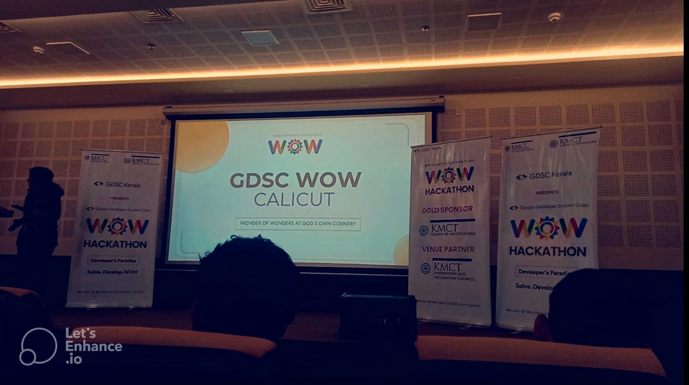

# Project Title

### Disaster Management and Climate Change Stopping, Monitoring, Awareness through an AI-Enabled Mobile Application and Website Platform.

## Tech Stack

| PART               | TECHNOLOGIES                                                    |
| :----------------- | :-------------------------------------------------------------- |
| `Client`           | **Html, Ejs, Ajax, TailWind-Css, Three.js, LeafLet.js, MapBox** |
| `Server`           | Node.js, MVC, Mongoose, Speech2Text, Chart.js, Mongodb-Atlas    |
| `API's`            | Nasa Api, Earthquack, Windy, Flood Warning                      |
| `Application`      | Flutter, Dart                                                   |
| `Machine Learning` | Python, TensorFlow, Algo's                                      |
| `Operating System` | Caching Technquie- Least Recent Used                            |

## The problem Disaster Management and Climate Change Stop solves

The "Disaster Management and Climate Change Stopping, Monitoring, Awareness" project addresses several critical problems related to natural disasters and climate change.

First, the project aims to improve disaster management and response by providing real-time alerts and updates about local areas and weather conditions. By keeping individuals and communities informed, the project can help reduce the vulnerability of communities to natural disasters and the impacts of climate change.

Second, the project seeks to raise awareness about the impacts of climate change and promote environmentally sustainable practices. By providing personalized climate change risk assessments and expert consultations and advice, the project can help individuals and communities understand the risks they face and take action to reduce their vulnerability.

Finally, the project aims to foster community engagement and collaboration, creating a platform for individuals and organizations to report natural disasters and climate change events, share best practices, and collaborate on disaster management and prevention efforts. By promoting community engagement and collaboration, the project can build more resilient communities that are better equipped to withstand the impacts of natural disasters and climate change.

### Challenges we ran into

The "Disaster Management and Climate Change Stopping, Monitoring, Awareness" project faced several challenges during its development and implementation.

One of the primary challenges was ensuring the accuracy and reliability of the data used in the project. The project relies heavily on data visualization and analysis to provide accurate predictions and insights, and ensuring the quality of this data required significant effort and expertise.

Another challenge was creating a user-friendly interface for the project's mobile application and website platforms. Designing an interface that was easy to use and accessible to individuals and communities with varying levels of technological literacy required careful consideration and testing.

Finally, the project faced challenges related to funding and resource allocation. Developing and implementing a project of this scale requires significant resources and support, and securing the necessary funding and resources can be a challenge.

Despite these challenges, the project team remained committed to its goal of empowering communities to take action against natural disasters and climate change. Through collaboration, innovation, and perseverance, the team overcame these challenges and successfully implemented a project that has the potential to make a significant positive impact on communities around the world.

## Prototype

## Jounery at GOOGLE WOW, KERALA

I am delighted to share with you that our team emerged as the winner of the **GOOGLE WOW HACKATHON 2023. 🏆🎉** This achievement brings me great joy and a tremendous sense of pride. The hackathon took place at KMCT College in Kozhikode, Kerala and it was an extraordinary experience that presented us with various challenges and countless opportunities. ✨🚀

During the hackathon, we choose the **topic "Climate Action" 🌍 from the 12 United Nations goals.** Our project, titled "Disaster Management and Climate Change," 🌪️🌱 #disaster focused on stopping, monitoring, and creating awareness through an AI-enabled mobile app and website. We progressed from the **first round with around 2000 participants to the final round, where only 36 teams faced a 36-hours coding challenge.** 💪 #finalist

On the final day, we presented our project to the judges, showcasing our robust system consisting of a web platform, user application, and ML model implementation. The judges were highly impressed by our ideas, comprehensive demonstration, and the positive impact we aimed to achieve in climate action.

Our journey ✈️ from **Pune to Kerala** added an exciting layer to the experience. We connected with like-minded students, immersed ourselves in the local culture, and admired the **natural beauty of Kerala.** From breathtaking beaches 🏖️ to vibrant markets, every moment was filled with memorable experiences. 🌴🌊🌺 #unforgettablejourney

Winning this hackathon is a testament to our dedication, perseverance, and innovative thinking. Being part of this event has provided invaluable learnings, friendships, and cherished memories. Upendra Taral Pratham Pawale Chinmay Beldar 😎💪
